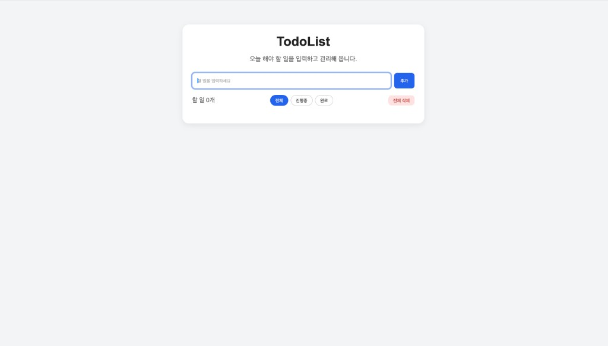
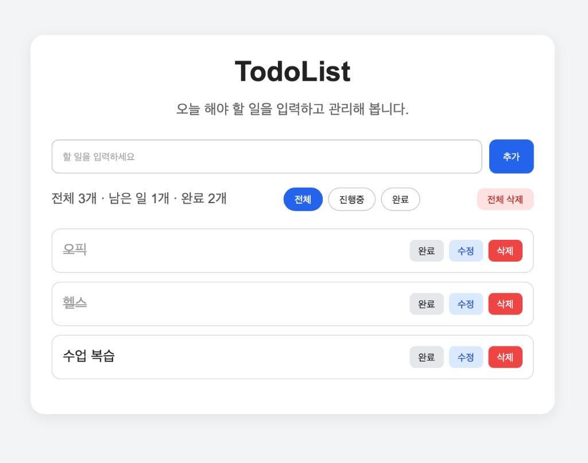

# TodoList

오늘 해야 할 일을 입력하고 관리하는 간단한 할 일 관리 웹 앱입니다.

HTML, CSS, JavaScript로 구현했으며, 브라우저에서 `index.html`을 열면 바로 사용할 수 있습니다.

## 화면 미리보기

### 초기 화면 (할 일 없음)

할 일이 없을 때의 기본 화면입니다. 입력창과 필터, 전체 삭제 버튼이 준비되어 있고, 할 일 개수는 `0개`로 표시됩니다.



### 할 일 추가 후

할 일을 추가하면 목록에 표시되고, 상단에 `전체 · 남은 일 · 완료` 개수가 함께 보입니다.  
완료된 항목은 취소선과 회색 처리로 구분됩니다.



## 주요 기능

- **추가**: 입력창에 할 일을 적고 `추가` 버튼을 누르면 목록에 등록됩니다.
- **완료**: 각 항목의 `완료` 버튼으로 완료 상태를 표시합니다.
- **수정**: `수정` 버튼으로 할 일 내용을 바꿀 수 있습니다.
- **삭제**: `삭제` 버튼으로 개별 항목을 지울 수 있습니다.
- **필터**: `전체` / `진행중` / `완료`로 목록을 나눠 볼 수 있습니다.
- **전체 삭제**: `전체 삭제` 버튼으로 목록을 한 번에 비울 수 있습니다.
- **개수 표시**: 전체, 남은 일, 완료 개수를 함께 보여줍니다.

## 파일 구성

```
Todo_List/
├── index.html      # 화면 구조
├── style.css       # 스타일
├── app.js          # 할 일 추가/수정/삭제/필터 로직
├── images/         # README용 캡처 화면
└── README.md
```

## 실행 방법

1. `Todo_List` 폴더로 이동합니다.
2. `index.html` 파일을 브라우저에서 엽니다.
3. 할 일을 입력하고 `추가` 버튼을 눌러 사용해 보세요.
