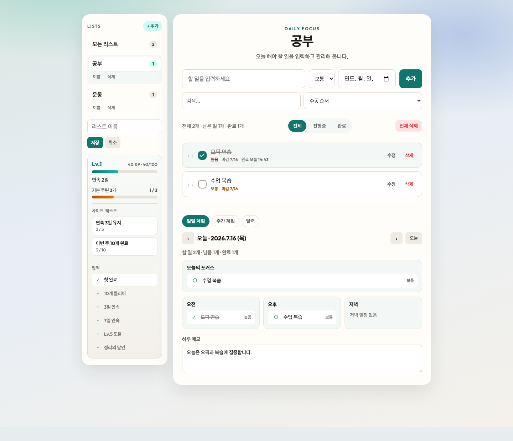
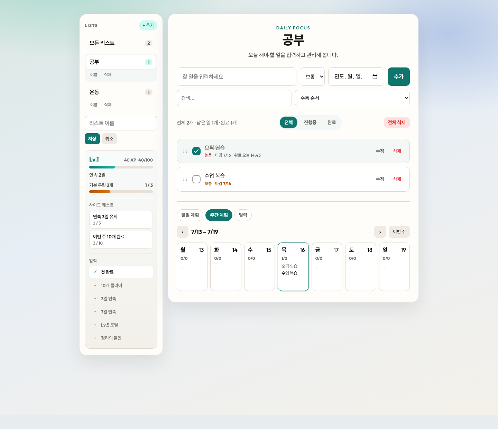
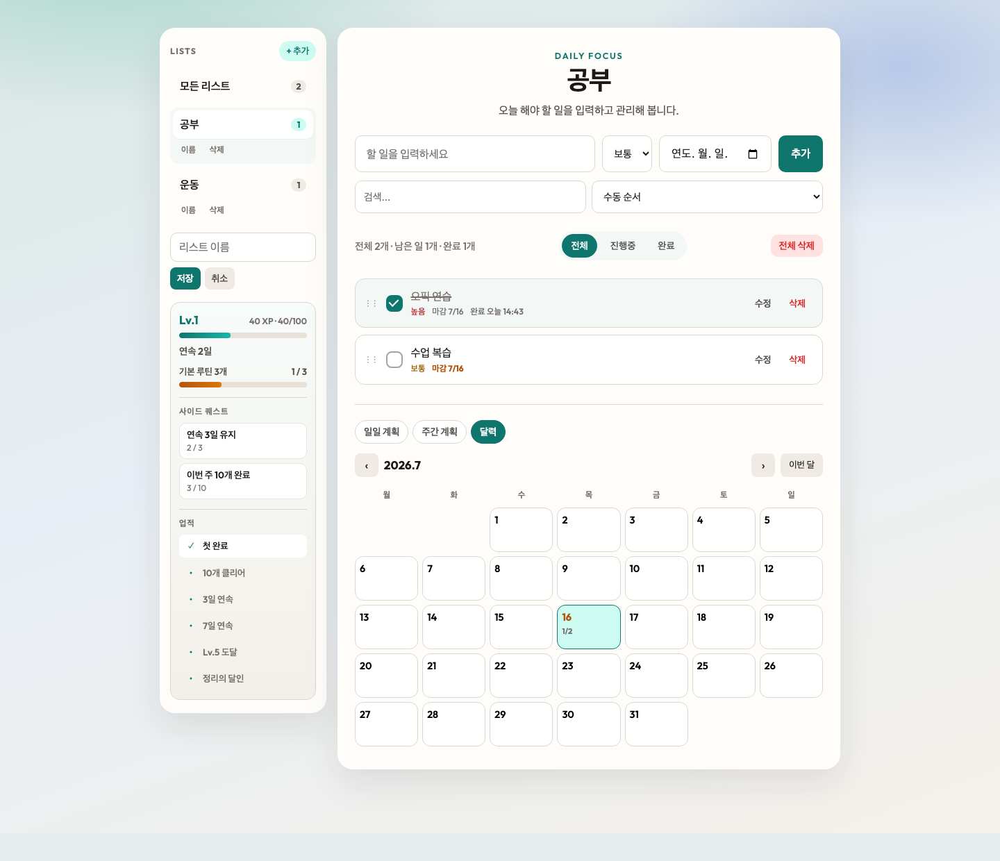
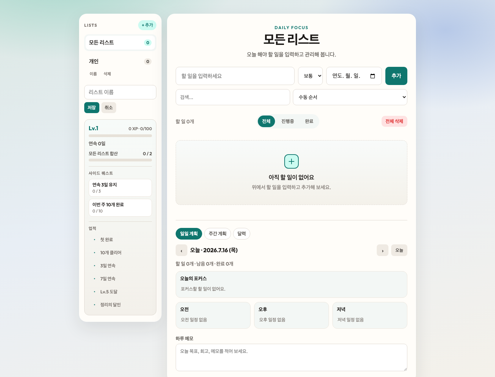

# TodoList

할 일을 관리하면서 XP·레벨·퀘스트로 가볍게 성장하는 개인용 Todo 앱입니다.  
HTML / CSS / Vanilla JS로 만들었고, 브라우저에서 `index.html`을 열면 바로 사용할 수 있습니다.

## 화면 미리보기

### 전체 화면 (할 일 + 사이드바 + 일일 계획)

리스트·게이밍 패널·할 일 목록·하단 일일 계획이 한 화면에 구성됩니다.



### 주간 계획

월~일 칸으로 한 주를 보고, 날짜를 누르면 일일 계획으로 이동합니다.



### 달력

월간 달력에서 날짜별 완료/전체 개수를 확인하고, 날짜를 선택해 일일 계획으로 들어갈 수 있습니다.



### 초기 화면

할 일이 없을 때의 기본 상태입니다.



## 주요 기능

### 할 일 관리
- 추가 / 완료 / 수정 / 삭제
- 우선순위(높음·보통·낮음), 마감일
- 검색, 정렬(수동·최신·마감·우선순위)
- 수동 순서일 때 드래그로 순서 변경
- 완료 시각 표시 (`완료 오늘 14:32`)

### 리스트(사이드바)
- 리스트 추가·이름 변경·삭제
- 리스트별 할 일 분리 / 모든 리스트 보기
- 리스트별 남은 할 일 개수 배지

### 게이밍
- 리스트별 XP · 레벨 · 연속일 · 오늘 목표
- 사이드 퀘스트(연속 3일, 이번 주 10개) + 보너스 XP
- 업적(첫 완료, 10개 클리어, 연속, 레벨 등)

### 계획표
- **일일 계획**: 포커스 / 오전·오후·저녁 / 하루 메모
- **주간 계획**: 요일별 할 일 요약
- **달력**: 월간 일정 한눈에 보기

## 파일 구성

```
Todo_List/
├── index.html
├── style.css
├── app.js
├── images/          # README용 캡처
├── 기능정의서.md
└── README.md
```

## 실행 방법

1. **이 폴더**의 `index.html`을 엽니다.  
   경로: `skala_practice/Todo_List/index.html`  
   (`Desktop/7월/Todo_List`는 예전 버전입니다.)
2. Live Server를 쓰거나 브라우저로 직접 엽니다.
3. 화면이 안 바뀌면 `Cmd + Shift + R`로 강제 새로고침 합니다.

데이터는 브라우저 `localStorage`에 저장되므로 새로고침해도 할 일과 진행도가 유지됩니다.
