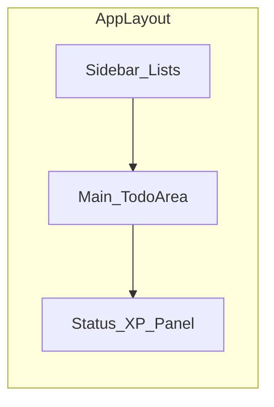
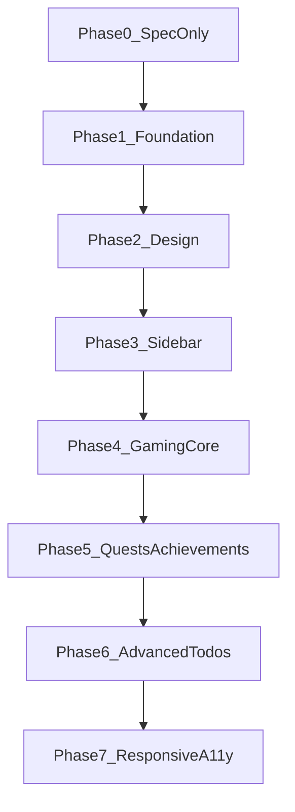

# Todo 확장 앱 — 기능정의서

> **작업 규칙:** 코드(`index.html`, `app.js`, `style.css` 등)는 **명시적으로 Phase를 요청하기 전까지 수정하지 않음**.  
> 이 문서는 기획·우선순위 기준용이며, Phase 0(문서 확정)까지가 현재 완료 범위입니다.

---

## 0. 확정 사항 (Decision Log)

| 항목 | 확정 내용 |
|------|-----------|
| 사이드 관리 | **둘 다** — 사이드바 리스트(C1~C4) + 사이드 퀘스트(C5~C7) |
| Phase 순서 | 아래 권장 순서 유지 (1 → 7). 변경 시 별도 요청 |
| 기술 스택 | HTML / CSS / Vanilla JS (프레임워크 전환은 별도 요청 시에만) |
| 코드 수정 | `Phase N부터 해줘`처럼 **한 Phase만** 요청할 때까지 앱 코드 변경 금지 |

---

## 1. 현재 상태 (As-Is)

기존 앱: `Todo_List/`

| 영역 | 현재 |
|------|------|
| 추가 / 완료 / 수정 / 삭제 | 있음 (`prompt`·`alert` 기반) |
| 필터 (전체 / 진행중 / 완료) | 있음 |
| 개수 표시 | 있음 |
| 전체 삭제 | 있음 |
| 데이터 저장 | **없음** (새로고침 시 사라짐) |
| 카테고리 / 우선순위 / 마감일 | 없음 |
| 디자인 | 단일 카드, 파란 포인트, 기본 폰트 |
| 게이밍 | 없음 |

---

## 2. 제품 목표 (To-Be)

**한 줄:** “할 일을 끝낼수록 성장하는, 보기 좋고 정리하기 쉬운 개인용 할 일 관리 앱”

- **기본:** 할 일 CRUD + 필터를 더 편하게
- **정리:** 사이드바(카테고리/리스트)로 할 일을 나눠 관리
- **동기:** XP·레벨·연속 기록·사이드 퀘스트 등 가벼운 게이밍
- **지속:** 브라우저에 데이터 저장 (localStorage)

---

## 3. 화면 구조 (IA)

- **사이드바:** 리스트/카테고리 선택·추가·이름 변경·삭제
- **메인:** 입력 + 필터 + 할 일 목록
- **상단/사이드 하단 상태 패널:** 레벨, XP, 오늘 완료 수, 연속 일수(스트릭)
- **사이드 퀘스트 영역:** 메인과 별도 보너스 미션 슬롯 (Phase 5)

---

## 4. 기능 정의 (Epics)

### A. 기반 (Foundation) — 확장의 전제

| ID | 기능 | 설명 | 완료 기준 |
|----|------|------|-----------|
| A1 | 데이터 모델 | 할 일: `id`, `text`, `done`, `createdAt`, `listId`, (선택) `priority`, `dueDate` | 객체 배열로 관리 |
| A2 | localStorage 저장/복원 | 새로고침 후에도 유지 | 재접속 시 동일 목록 |
| A3 | alert/prompt 제거 | 인라인 수정, 토스트/모달로 교체 | 브라우저 기본창 최소화 |
| A4 | 빈 상태 UI | 할 일 0개일 때 안내 문구/일러스트 영역 | empty 상태를 의도적으로 디자인 |

### B. 디자인 보완 (UI/UX)

| ID | 기능 | 설명 |
|----|------|------|
| B1 | 시각 톤 재정의 | CSS 변수로 색·간격·라운드 통일 (과한 보라/다크 기본 테마 지양) |
| B2 | 타이포·여백 | 제목/본문 계층, 카드·리스트 간격 정리 |
| B3 | 할 일 행 리디자인 | 체크박스 + 텍스트 + 액션(수정/삭제) 정리, 모바일에서도 버튼 겹침 감소 |
| B4 | 마이크로 인터랙션 | 추가/완료 시 짧은 애니메이션, 호버·포커스 상태 |
| B5 | 반응형 | 좁은 화면에서 사이드바 접기/오버레이 |
| B6 | 접근성 | 키보드 포커스, 버튼 `aria-label`, 대비 |

### C. 사이드 관리 (확정: 둘 다)

#### C-Side: 사이드바 리스트 관리 (Phase 3)

| ID | 기능 | 설명 |
|----|------|------|
| C1 | 리스트(카테고리) CRUD | 예: 공부 / 운동 / 개인 |
| C2 | 리스트별 할 일 분리 | 선택한 리스트의 할 일만 메인에 표시 |
| C3 | 전체 보기 | “모든 리스트” 합쳐 보기 |
| C4 | 리스트 순서/개수 배지 | 리스트별 남은 할 일 수 표시 |

#### C-Quest: 사이드 퀘스트 (Phase 5, 게이밍과 연결)

| ID | 기능 | 설명 |
|----|------|------|
| C5 | 사이드 퀘스트 슬롯 | 메인과 별도 짧은 보너스 미션 1~3개 |
| C6 | 일일/주간 퀘스트 | 예: “오늘 3개 완료”, “연속 3일” |
| C7 | 퀘스트 보상 | 완료 시 추가 XP / 뱃지 |

### D. 게이밍 요소

| ID | 기능 | 설명 | 규칙 초안 |
|----|------|------|-----------|
| D1 | XP | 할 일 완료 시 획득 | 완료 +10 XP. **완료 취소 시 XP 회수** (구현 시 이 규칙 적용) |
| D2 | 레벨 | XP 누적으로 레벨업 | Lv = floor(XP/100)+1 |
| D3 | 스트릭 | 하루 1개 이상 완료 시 연속일 +1 | 자정 기준(로컬) |
| D4 | 일일 목표 | 오늘 N개 완료 목표 게이지 | 기본 N=3 |
| D5 | 업적/뱃지 | 조건 달성 시 잠금 해제 | 예: 첫 완료, 10개 완료, 7일 스트릭 |
| D6 | 피드백 | 레벨업·업적 시 짧은 연출 | 토스트 + 가벼운 이펙트 |

**게이밍 톤:** 부담 없는 “가벼운 RPG 감각”. 패널티·경쟁·과금 없음.

### E. 할 일 고도화 (후순위)

| ID | 기능 | 설명 |
|----|------|------|
| E1 | 우선순위 | 높음/보통/낮음 |
| E2 | 마감일 | 날짜 표시 + 오늘/지난 강조 |
| E3 | 정렬 | 최신순 / 마감순 / 우선순위 |
| E4 | 검색 | 텍스트 검색 |
| E5 | 드래그 정렬 | 수동 순서 변경 |

### F. 범위 밖 (이번 로드맵에서 제외)

- 회원가입 / 서버 DB / 실시간 동기화
- 모바일 네이티브 앱
- 다인 협업·공유 보드

---

## 5. 구현 순서 (Phase) — 확정

| Phase | 내용 | 포함 ID | 상태 |
|-------|------|---------|------|
| **0** | 문서 확정, 코드 변경 없음 | — | **완료** (본 문서) |
| **1** | 기반: 데이터 모델 + localStorage + alert 정리 | A1~A4 | **완료** |
| **2** | 디자인 리뉴얼 (레이아웃·색·할 일 행) | B1~B4 | **완료** |
| **3** | 사이드바 리스트 관리 | C1~C4 | **완료** |
| **4** | 게이밍 코어 (XP/레벨/스트릭/일일목표) | D1~D4 | **완료** |
| **5** | 사이드 퀘스트 + 업적 | C5~C7, D5~D6 | **완료** |
| **6** | 고도화 (우선순위·마감·검색 등) | E1~E5 | **완료** |
| **7** | 반응형·접근성 마감 | B5~B6 | **완료** |

---

## 6. 다음 요청 방법

코드를 손대려면 아래처럼 **Phase 하나만** 지정해 주세요.

- 예: `Phase 1부터 해줘`
- 예: `Phase 2만 디자인 리뉴얼해줘`

순서·범위를 바꾸고 싶으면 그 내용을 먼저 말해 주시면 이 문서를 갱신한 뒤 진행합니다.
