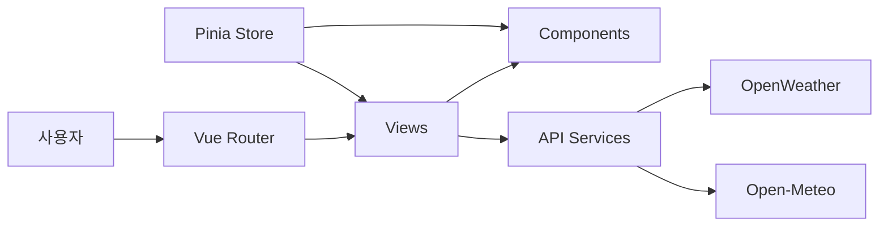
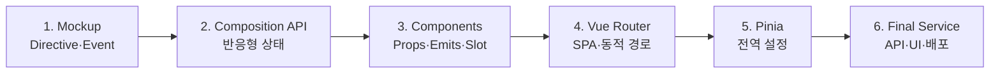

# 🌤️ Weather Desk

> 실시간 날씨와 생활 환경 정보를 한곳에서 확인하고, 오늘의 행동까지 결정할 수 있는 Vue 3 날씨 서비스

[](https://vuejs.org/)
[](https://vite.dev/)
[](https://element-plus.org/)
[](https://pinia.vuejs.org/)
[](https://axios-http.com/)

## 🔗 프로젝트 링크

| 구분 | 주소 |
| --- | --- |
| 배포 사이트 | `Vercel 배포 후 주소 입력 예정` |
| GitHub | [juhun-ham/skala_practice - weather-final](https://github.com/juhun-ham/skala_practice/tree/main/vue.js/weather-final) |

## 프로젝트 소개

Weather Desk는 OpenWeather와 Open-Meteo의 데이터를 결합한 생활 날씨 서비스입니다.

단순히 기온만 보여주는 대신 현재 날씨, 시간대별 예보, 5일 예보, 공기질과 자외선 정보를 함께 제공하며, 환경 수치에 맞는 행동요령을 자동으로 계산합니다.

```text
날씨·환경 API
      ↓ Axios 비동기 요청
Vue 반응형 상태(ref / computed)
      ↓
로딩 · 성공 · 오류 화면 처리
      ↓
Element Plus 반응형 UI
```

## ✨ 주요 기능

| 기능 | 설명 |
| --- | --- |
| 실시간 날씨 | 서울·수원·부산의 현재 기온, 습도와 기상 상태 조회 |
| 도시 검색 | 한글 입력과 동시에 일치하는 도시를 필터링 |
| 더운 도시 필터 | 사용자가 설정한 기준 온도 이상인 도시만 표시 |
| 단위 전환 | 모든 화면의 온도를 섭씨(℃) 또는 화씨(℉)로 전환 |
| 기준 온도 설정 | Pinia Store를 통해 더움 판단 기준을 전역으로 관리 |
| 도시 상세 화면 | 동적 경로 `/weather/:cityId`로 도시별 상세 정보 제공 |
| 시간대별·5일 예보 | 앞으로 24시간과 약 5일간의 날씨 흐름 표시 |
| 환경 정보 | 도시별 AQI, 미세먼지, 초미세먼지와 자외선 조회 |
| 맞춤 행동요령 | 공기질과 자외선 수치를 `computed`로 분석해 안내 제공 |
| 요청 상태 처리 | API 로딩, 오류, 빈 검색 결과와 다시 시도 UI 제공 |
| SPA 라우팅 | 새로고침 없이 대시보드·가이드·소개·상세 페이지 이동 |
| 반응형 UI | Element Plus를 활용한 데스크톱·모바일 대응 화면 |

## 🧭 화면 구성

| 경로 | 화면 | 역할 |
| --- | --- | --- |
| `/weather` | 날씨 대시보드 | 도시 검색, 필터와 현재 날씨 목록 |
| `/weather/guide` | 날씨 가이드 | 도시별 환경 정보와 맞춤 행동요령 |
| `/weather/about` | 서비스 소개 | 현재 기능, 개발 과정과 기술 구조 소개 |
| `/weather/:cityId` | 도시 상세 | 현재 관측값, 시간대별·5일 예보 |
| 잘못된 주소 | 404 페이지 | 존재하지 않는 경로 안내 |

## 🛠️ 기술 스택

| 분류 | 기술 | 사용 목적 |
| --- | --- | --- |
| Frontend | Vue 3 Composition API | 컴포넌트와 반응형 상태 구성 |
| Build Tool | Vite | 개발 서버 및 정적 배포용 빌드 |
| Routing | Vue Router | SPA 페이지 이동과 동적 도시 경로 처리 |
| State | Pinia | 날씨 단위와 더움 기준 전역 관리 |
| HTTP | Axios | 외부 API 비동기 통신 |
| UI | Element Plus | 카드, 탭, 입력창, 로딩 및 오류 UI |
| Weather API | OpenWeather | 현재 날씨와 시간대별·5일 예보 |
| Environment API | Open-Meteo | 공기질, 미세먼지와 자외선 데이터 |
| Deployment | Vercel | 정적 웹 애플리케이션 배포 예정 |

## 🧩 서비스 구조



```text
src/
├── assets/                    # 공통 스타일
├── components/exercise/       # 검색, 날씨 카드, 단위 설정 등의 UI 부품
├── router/index.js            # 페이지 경로 규칙
├── services/
│   ├── weatherApi.js          # OpenWeather 요청
│   └── airQualityApi.js       # Open-Meteo 요청
├── stores/configStore.js      # 단위와 더움 기준 전역 상태
├── utils/weatherDisplay.js    # 날씨 코드 → 쉬운 이름·이모지 변환
└── views/                     # 대시보드, 상세, 가이드, 소개, 404 페이지
```

## 📚 개발 과정

처음부터 완성된 서비스를 만든 것이 아니라 Vue의 핵심 개념을 한 단계씩 적용했습니다.



1. **Weather Mockup** — `v-for`, `v-if`, `v-model`, 이벤트로 기본 화면을 구현했습니다.
2. **Composition API** — `ref`, `computed`, `watch`, `watchEffect`로 검색과 필터 상태를 관리했습니다.
3. **Component 분리** — 검색창과 날씨 카드를 분리하고 Props, Emits, Slot으로 연결했습니다.
4. **Vue Router 적용** — 페이지와 URL을 연결하고 도시 ID를 받는 동적 상세 경로를 만들었습니다.
5. **Pinia Store 적용** — 여러 화면에서 같은 단위와 더움 기준을 공유하도록 구성했습니다.
6. **실제 서비스 확장** — Axios로 외부 API를 연결하고 로딩·오류 처리 및 Element Plus UI를 추가했습니다.

## 🚀 로컬 실행 방법

### 1. 프로젝트 폴더로 이동

```bash
cd vue.js/weather-final
```

### 2. 패키지 설치

```bash
npm install
```

### 3. 환경 변수 설정

프로젝트 루트의 `.env.example`을 참고하여 `.env.local`을 생성합니다.

```env
VITE_OPENWEATHER_API_KEY=발급받은_OpenWeather_API_KEY
```

> API 키가 들어 있는 `.env.local` 파일은 GitHub에 올리지 않습니다.

### 4. 개발 서버 실행

```bash
npm run dev
```

브라우저에서 안내되는 주소(기본값 `http://localhost:5173`)로 접속합니다.

## 📦 빌드 방법

```bash
npm run build
```

빌드가 완료되면 정적 배포 파일이 `dist/` 폴더에 생성됩니다.

```bash
npm run preview
```

위 명령으로 배포 전 빌드 결과를 로컬에서 확인할 수 있습니다.

## 🔐 API 및 보안

- OpenWeather API 키는 `.env.local`에서 관리합니다.
- `.env.local`은 Git에 커밋하지 않습니다.
- 프런트엔드 환경 변수는 브라우저에서 완전히 숨길 수 없으므로 API 제공자의 키 제한 정책을 함께 설정해야 합니다.
- Open-Meteo Air Quality API는 별도 API 키 없이 사용합니다.

## 👤 제작자

- 함주훈
- Vue.js 최종 과제 프로젝트
